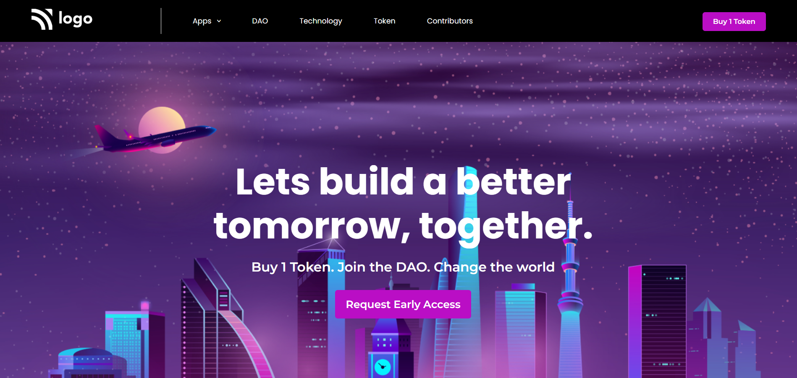

# Full Stack Javascript Bootcamp Assignment 

# Live Project 5 : Crypto Landing page

## Project 5: (Mobile Responsive)
[Live Link](https://live-project-5-fs-js.netlify.app/)

-   Skills Gained in this project.
    - Learned how to create dropdown element.
    - Learned to arrange large image as a background in the DOM.
    - Adding a vertical line element in navbar
    
---

## Time taken to finish this project(including adding media queries)⏲

- >4 hours are needed to finish the whole project except for that dropdown icon at the navbar which took an extra 30min.

#### Screenshot

